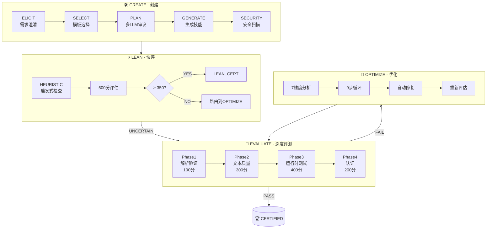

# Skill Framework 🏆

> **让 AI 技能像软件一样可测试、可迭代**

<p align="center">
  <a href="LICENSE"></a>
  
  
  
</p>

---

## 🚀 30秒快速开始

```bash
# 1. 克隆仓库
git clone https://github.com/theneoai/skill-framework.git
cd skill-framework

# 2. 创建你的第一个技能
skill create --template api-integration --name my-api-skill

# 3. 快速评估
skill evaluate my-api-skill.md

# 4. 查看报告
cat my-api-skill.eval.json
```

### 💡 代码示例

```yaml
---
name: weather-query
version: "1.0.0"
description: "Query weather data from OpenWeather API"
description_i18n:
  zh: "从 OpenWeather API 查询天气数据"
  en: "Query weather data from OpenWeather API"

interface:
  input: city-name
  output: temperature-humidity-conditions
  modes: [query, batch]
---

## §1 Identity

**Name**: weather-query
**Role**: Weather Data Fetcher
**Purpose**: Retrieve current weather conditions for any city worldwide.

## §2 Mode Router

```
User Input
    │
    ▼
PARSE: extract city name, detect language (ZH / EN)
    │
    ▼
ROUTE
  query  [查询,天气,温度 | weather,forecast,temp]
  batch  [批量,多个城市 | batch,multiple,cities]
```

## §3 Red Lines (严禁)

- 严禁 hardcoded API keys (CWE-798) — use env var `OPENWEATHER_API_KEY`
- 严禁 return raw API responses without validation
- 严禁 cache data longer than 10 minutes
```

### 📊 评估报告示例

```json
{
  "skill": "weather-query",
  "version": "1.0.0",
  "total_score": 940,
  "tier": "GOLD",
  "phases": {
    "parse_validate": 95,
    "text_quality": 285,
    "runtime_testing": 385,
    "certification": 175
  },
  "variance": 1.25,
  "f1": 0.94,
  "mrr": 0.91,
  "status": "CERTIFIED"
}
```

---

## 🏗️ 架构概览

Skill Framework 采用 **4模式工作流**，覆盖技能全生命周期：



### 工作流程说明

| 模式 | 用途 | 耗时 | 输出 |
|------|------|------|------|
| **CREATE** | 从模板创建新技能 | 5-10分钟 | 初版技能文件 |
| **LEAN** | 快速质量筛查 | ~1秒 | LEAN_CERT / 路由决策 |
| **EVALUATE** | 4阶段1000分深度评测 | 3-5分钟 | 详细评估报告 + 认证等级 |
| **OPTIMIZE** | 7维度9步自动优化 | 10-30分钟 | 改进版技能 + 优化日志 |

---

## ✨ 核心特性

### 🎯 1000分评估体系

行业首个针对 AI 技能的标准化评分系统：

- **Phase 1** (100分): 结构完整性检查
- **Phase 2** (300分): 文本质量分析（6维度）
- **Phase 3** (400分): 运行时测试（触发准确性、边界情况）
- **Phase 4** (200分): 综合认证（方差控制、安全扫描）

### 🤖 多LLM审议机制

借鉴司法陪审团制度，3个LLM独立评分后交叉验证：

| LLM | 角色 | 职责 |
|-----|------|------|
| LLM-1 | Generator | 生成初稿 / Phase 2评分 |
| LLM-2 | Reviewer | 安全审计 / Phase 3测试 |
| LLM-3 | Arbiter | 仲裁分歧 / 最终认证 |

**共识规则**: UNANIMOUS → 通过 | MAJORITY → 通过并记录 | SPLIT → 修订 | UNRESOLVED → 人工审核

### 🔄 自进化系统（3触发器）

| 触发器 | 条件 | 自动行动 |
|--------|------|----------|
| **Threshold** | F1 < 0.90 或 MRR < 0.85 | 标记 → 进入OPTIMIZE队列 |
| **Time** | 30天未更新 | 安排新鲜度检查 |
| **Usage** | 90天内调用 < 5次 | 评估废弃或重新定位 |

### 🌏 原生双语支持

- 所有模板内置中英文触发词
- 评估报告双语输出
- 示例代码支持混合语言输入

---

## 🏅 认证等级

| 等级 | 分数要求 | 最大方差 | 徽章 |
|------|----------|----------|------|
| **PLATINUM** | ≥ 950 | < 10 | 🏆 |
| **GOLD** | ≥ 900 | < 15 | 🥇 |
| **SILVER** | ≥ 800 | < 20 | 🥈 |
| **BRONZE** | ≥ 700 | < 30 | 🥉 |
| **FAIL** | < 700 | — | ❌ |

> **方差说明**: 高方差表示"纸上谈兵"（Phase2 >> Phase3）或"通过测试但文档差"（Phase3 >> Phase2），都表明质量不一致。

---

## 📚 示例技能展示

探索我们精心设计的示例技能：

| 示例 | 描述 | 等级 |
|------|------|------|
| [API Tester](examples/api-tester/) | 自动化API测试与验证 | 🏆 PLATINUM |
| [Code Reviewer](examples/code-reviewer/) | 智能代码审查助手 | 🥇 GOLD |
| [Doc Generator](examples/doc-generator/) | 自动化文档生成 | 🥇 GOLD |

每个示例都包含：
- ✅ 完整的技能定义文件
- ✅ 评估报告
- ✅ 优化历史记录

---

## 🚀 快速开始（详细版）

### 安装

```bash
# 通过 pip 安装
pip install skill-framework

# 或通过源码安装
git clone https://github.com/theneoai/skill-framework.git
cd skill-framework
pip install -e .
```

### 创建第一个技能

```bash
# 步骤1: 初始化项目
skill init my-project
cd my-project

# 步骤2: 选择模板类型
# - api-integration: API集成类技能
# - data-pipeline: 数据处理类技能
# - workflow-automation: 工作流自动化
# - base: 基础模板

skill create --template api-integration --name weather-query

# 步骤3: 回答6个需求澄清问题
# 1. 这个skill要解决什么核心问题？
# 2. 主要用户是谁，技术水平如何？
# 3. 输入是什么形式？
# 4. 期望的输出是什么？
# 5. 有哪些安全或技术约束？
# 6. 验收标准是什么？

# 步骤4: 运行评估
skill evaluate weather-query.md

# 步骤5: 查看结果
skill report weather-query.md --format html
```

### 评估报告示例

```
SKILL EVALUATION REPORT
=======================
Skill:      weather-query v1.0.0
Evaluated:  2026-03-31T10:30:00Z
Evaluator:  skill-framework v2.0.0

PHASE SCORES
  Phase 1 — Parse & Validate:   95 / 100
  Phase 2 — Text Quality:       285 / 300
    System Design:     57/60   Error Handling: 42/45
    Domain Knowledge:  56/60   Examples:       43/45
    Workflow:          57/60   Metadata:       30/30
  Phase 3 — Runtime Testing:    385 / 400
    Trigger Routing:   116/120  Output Contract:   58/60
    Bilingual:         78/80   Error Handling RT: 48/50
    Negative/Edge:     58/60   Security Boundary: 27/30
  Phase 4 — Certification:      175 / 200
    Variance Gate:    40/40    F1 Gate:    40/40
    Security Scan:    55/60    MRR Gate:   30/30
    Consensus:        30/30

TOTAL SCORE:     940 / 1000
VARIANCE:        1.25  (threshold for tier: <15)
F1:              0.94  (threshold: ≥ 0.90)  [PASS]
MRR:             0.91  (threshold: ≥ 0.85)  [PASS]
TRIGGER ACC:     0.93  (threshold: ≥ 0.90)  [PASS]

SECURITY SCAN
  P0: CLEAR
  P1: CLEAR

CERTIFICATION TIER:  GOLD
STATUS:              CERTIFIED
NEXT ACTION:         Ready for production deployment
```

---

## 📖 文档

| 文档 | 描述 |
|------|------|
| [skill-framework.md](skill-framework.md) | 框架完整规范（582行） |
| [eval/rubrics.md](eval/rubrics.md) | 1000分评估细则（237行） |
| [optimize/strategies.md](optimize/strategies.md) | 7维度9步优化策略（319行） |

### 参考文档

- [refs/deliberation.md](refs/deliberation.md) - 多LLM审议协议
- [refs/evolution.md](refs/evolution.md) - 自进化系统规范
- [refs/security-patterns.md](refs/security-patterns.md) - CWE安全模式
- [refs/convergence.md](refs/convergence.md) - 收敛检测算法
- [refs/use-to-evolve.md](refs/use-to-evolve.md) - UTE自进化机制

---

## 🤝 贡献

我们欢迎所有形式的贡献！

```bash
# Fork 仓库
git clone https://github.com/YOUR_USERNAME/skill-framework.git

# 创建分支
git checkout -b feature/amazing-feature

# 提交更改
git commit -m "Add amazing feature"

# 推送分支
git push origin feature/amazing-feature

# 创建 Pull Request
```

### 贡献指南

1. **新技能模板**: 参考 [templates/](templates/) 目录
2. **优化策略**: 添加到 [optimize/strategies.md](optimize/strategies.md)
3. **评估基准**: 更新 [eval/benchmarks.md](eval/benchmarks.md)
4. **Bug修复**: 确保通过所有测试

---

## 📄 许可证

[MIT License](LICENSE) © 2026 theneoai

---

<p align="center">
  <strong>Skill Framework</strong> — 让每一次 Prompt 都值得信赖
</p>

<p align="center">
  <a href="https://github.com/theneoai/skill-framework">GitHub</a> •
  <a href="https://skill-framework.readthedocs.io">文档</a> •
  <a href="https://discord.gg/skill-framework">Discord</a>
</p>
