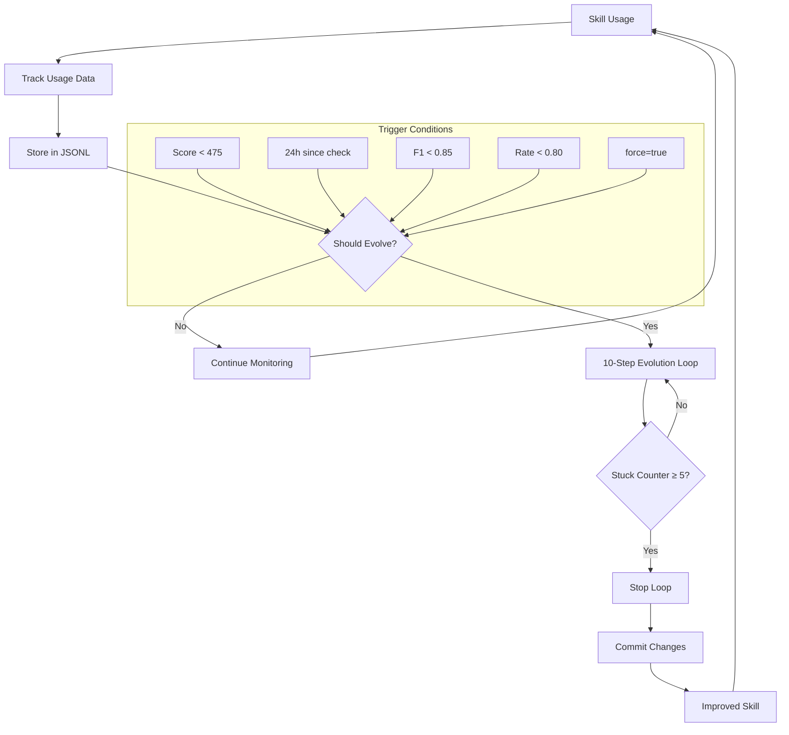
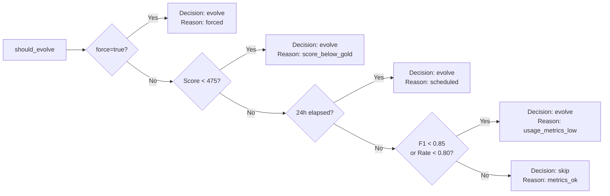
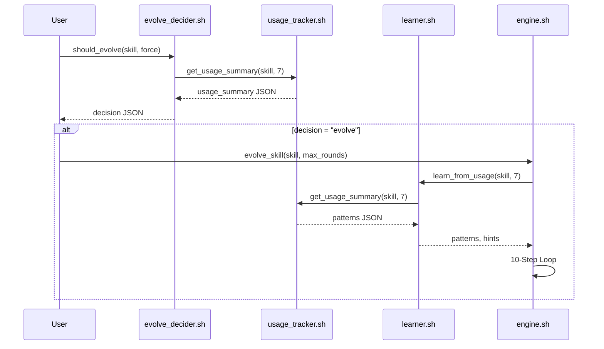
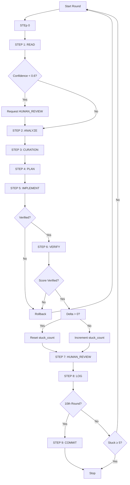
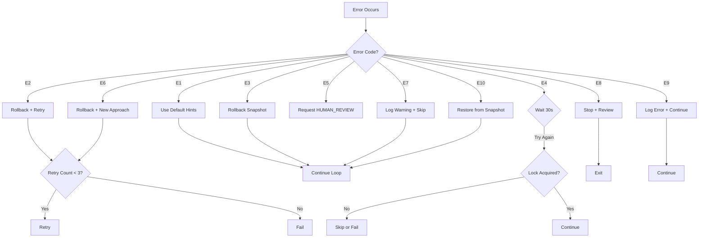
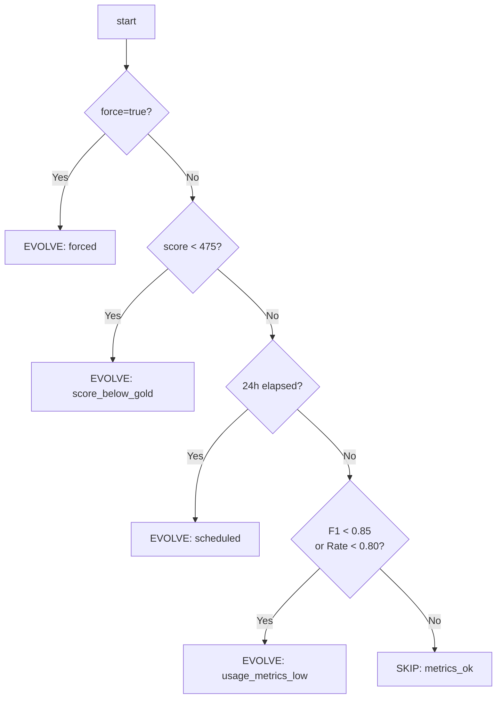

# Auto-Evolution Workflow

**Version:** 2.0  
**Last Updated:** 2026-03-28  
**Workflow Engine:** `engine/evolution/engine.sh`

The auto-evolution workflow continuously improves skills based on usage data, using a multi-LLM deliberation system to ensure high-quality optimizations.

---

## Table of Contents

1. [流程概览](#1-流程概览)
2. [触发机制](#2-触发机制)
3. [使用数据收集](#3-使用数据收集)
4. [模式学习](#4-模式学习)
5. [增强的 10 步循环](#5-增强的-10-步循环)
6. [CLI 参考](#6-cli-参考)
7. [错误处理](#7-错误处理)
8. [最佳实践](#8-最佳实践)
9. [文件结构](#9-文件结构)
10. [相关文档](#10-相关文档)

---

## 1. 流程概览

### 1.1 整体流程图

The auto-evolution workflow operates as a continuous improvement loop that analyzes usage patterns and applies multi-LLM guided optimizations.



### 1.2 决策流程



### 1.3 核心组件交互



---

## 2. 触发机制

Auto-evolution triggers when **any** of the following conditions are met.

### 2.1 阈值触发 (Threshold Trigger)

**Condition:** Skill score drops below GOLD threshold (475)

| Parameter | Value | Description |
|-----------|-------|-------------|
| `GOLD_THRESHOLD` | 475 | Minimum score for GOLD tier |
| `SILVER_THRESHOLD` | 425 | Minimum score for SILVER tier |
| `BRONZE_THRESHOLD` | 350 | Minimum score for BRONZE tier |

**Implementation:** `evolve_decider.sh:17-37`

```bash
# Check if score is below threshold
current_score=$(bash scripts/lean-orchestrator.sh "$skill_file" SILVER 2>/dev/null | jq -r '.total // 0')

if (( $(echo "$current_score < $GOLD_THRESHOLD" | bc -l) )); then
    echo "{\"decision\": \"evolve\", \"reason\": \"score_below_gold\", \"score\": $current_score}"
fi
```

**Example Output:**
```json
{"decision": "evolve", "reason": "score_below_gold_423", "score": 423}
```

### 2.2 定时触发 (Scheduled Trigger)

**Condition:** 24 hours have elapsed since last evolution check

| Parameter | Value | Description |
|-----------|-------|-------------|
| `CHECK_INTERVAL_HOURS` | 24 | Minimum hours between checks |
| `LAST_CHECK_FILE` | `logs/evolution/.last_evolution_check` | Timestamp of last check |

**Implementation:** `evolve_decider.sh:60-74`

```bash
should_check_scheduled() {
    if [[ ! -f "$LAST_CHECK_FILE" ]]; then
        return 0  # First run
    fi
    
    last_check=$(cat "$LAST_CHECK_FILE")
    last_check_epoch=$(date -j -f "%Y-%m-%dT%H:%M:%SZ" "$last_check" +%s)
    now_epoch=$(date +%s)
    hours_elapsed=$(( (now_epoch - last_check_epoch) / 3600 ))
    
    [[ $hours_elapsed -ge $CHECK_INTERVAL_HOURS ]]
}
```

**Example Output:**
```json
{"decision": "evolve", "reason": "scheduled", "score": 482}
```

### 2.3 使用指标触发 (Usage Metrics Trigger)

**Condition:** Either trigger F1 score < 0.85 OR task completion rate < 0.80

| Metric | Threshold | Source Function |
|--------|-----------|-----------------|
| `trigger_f1` | < 0.85 | `get_usage_summary()` |
| `task_completion_rate` | < 0.80 | `get_usage_summary()` |

**Implementation:** `evolve_decider.sh:44-55`

```bash
usage_summary=$(source engine/evolution/usage_tracker.sh && get_usage_summary "$skill_name" 7)

trigger_f1=$(echo "$usage_summary" | jq -r '.trigger_f1')
task_rate=$(echo "$usage_summary" | jq -r '.task_completion_rate')

if (( $(echo "$trigger_f1 < 0.85" | bc -l) )) || (( $(echo "$task_rate < 0.80" | bc -l) )); then
    echo "{\"decision\": \"evolve\", \"reason\": \"usage_metrics_low\", ...}"
fi
```

**Example Output:**
```json
{"decision": "evolve", "reason": "usage_metrics_low", "trigger_f1": 0.72, "task_rate": 0.65, "score": 501}
```

### 2.4 手动触发 (Manual Trigger)

**Condition:** User explicitly forces evolution with `force=true`

```bash
bash engine/evolution/evolve_decider.sh SKILL.md true
```

**Example Output:**
```json
{"decision": "evolve", "reason": "forced", "score": 501}
```

### 2.5 触发决策汇总表

| Trigger Type | Priority | Condition | Decision Reason |
|--------------|----------|-----------|-----------------|
| Manual | 1 (highest) | `force=true` | `forced` |
| Threshold | 2 | `score < 475` | `score_below_gold_<score>` |
| Scheduled | 3 | `24h since last check` | `scheduled` |
| Usage Metrics | 4 | `F1 < 0.85 or Rate < 0.80` | `usage_metrics_low` |
| Skip | - | None of above | `metrics_ok` |

---

## 3. 使用数据收集

The system tracks three types of usage events to understand skill behavior.

### 3.1 track_trigger()

Tracks whether the skill correctly identified the execution mode.

**File:** `engine/evolution/usage_tracker.sh:19-40`

| Parameter | Type | Required | Description |
|-----------|------|----------|-------------|
| `skill_name` | string | Yes | Name of the skill (without .md) |
| `expected_mode` | string | Yes | Expected mode (CREATE/EVALUATE/OPTIMIZE/etc) |
| `actual_mode` | string | Yes | Actual mode detected by skill |

**Event Type:** `trigger`

**Example:**
```bash
source engine/evolution/usage_tracker.sh

# Track a correct trigger
track_trigger "skill" "OPTIMIZE" "OPTIMIZE"

# Track an incorrect trigger
track_trigger "skill" "CREATE" "EVALUATE"
```

**Output (JSONL entry in `logs/evolution/usage_skill_<date>.jsonl`):**
```json
{"timestamp":"2026-03-28T14:30:00Z","skill":"skill","event_type":"trigger","expected_mode":"OPTIMIZE","actual_mode":"OPTIMIZE","correct":true}
```
```json
{"timestamp":"2026-03-28T14:35:00Z","skill":"skill","event_type":"trigger","expected_mode":"CREATE","actual_mode":"EVALUATE","correct":false}
```

**Trigger Mode Reference:**

| Mode | Description |
|------|-------------|
| `CREATE` | Skill used to create new content |
| `EVALUATE` | Skill used for evaluation |
| `OPTIMIZE` | Skill used for optimization |
| `DEBUG` | Skill used for debugging |
| `REVIEW` | Skill used for code review |

### 3.2 track_task()

Tracks task completion and rounds.

**File:** `engine/evolution/usage_tracker.sh:42-59`

| Parameter | Type | Required | Description |
|-----------|------|----------|-------------|
| `skill_name` | string | Yes | Name of the skill |
| `task_type` | string | Yes | Type of task performed |
| `completed` | boolean | Yes | Whether task completed successfully |
| `rounds` | integer | No | Number of rounds taken (default: 1) |

**Event Type:** `task`

**Example:**
```bash
# Track successful task
track_task "skill" "code_review" "true" 3

# Track failed task
track_task "skill" "debug_session" "false" 5
```

**Output (JSONL):**
```json
{"timestamp":"2026-03-28T15:00:00Z","skill":"skill","event_type":"task","task_type":"code_review","completed":true,"rounds":3}
```
```json
{"timestamp":"2026-03-28T15:30:00Z","skill":"skill","event_type":"task","task_type":"debug_session","completed":false,"rounds":5}
```

### 3.3 track_feedback()

Tracks user feedback ratings.

**File:** `engine/evolution/usage_tracker.sh:61-76`

| Parameter | Type | Required | Description |
|-----------|------|----------|-------------|
| `skill_name` | string | Yes | Name of the skill |
| `rating` | number | Yes | Rating (typically 1-5) |
| `comment` | string | No | Optional user comment |

**Event Type:** `feedback`

**Example:**
```bash
# Track positive feedback
track_feedback "skill" "5" "Excellent pattern recognition"

# Track negative feedback
track_feedback "skill" "2" "Failed to detect OPTIMIZE mode"
```

**Output (JSONL):**
```json
{"timestamp":"2026-03-28T16:00:00Z","skill":"skill","event_type":"feedback","rating":5,"comment":"Excellent pattern recognition"}
```

### 3.4 get_usage_summary()

Aggregates usage data over a specified period.

**File:** `engine/evolution/usage_tracker.sh:78-149`

| Parameter | Type | Required | Description |
|-----------|------|----------|-------------|
| `skill_name` | string | Yes | Name of the skill |
| `days` | integer | No | Number of days to analyze (default: 7) |

**Returns:** JSON object with aggregated metrics

**Example:**
```bash
source engine/evolution/usage_tracker.sh
get_usage_summary "skill" 7
```

**Output:**
```json
{
  "trigger_f1": 0.8571,
  "task_completion_rate": 0.7500,
  "avg_feedback_rating": 4.25,
  "stats": {
    "triggers": {"total": 14, "correct": 12},
    "tasks": {"total": 8, "completed": 6},
    "feedback": {"count": 4}
  }
}
```

### 3.5 Usage Data Flow

```mermaid
flowchart LR
    A[track_trigger] --> B[JSONL File]
    C[track_task] --> B
    D[track_feedback] --> B
    
    B --> E[get_usage_summary]
    E --> F[evolve_decider.sh]
    E --> G[learner.sh]
    
    subgraph "File Naming"
    B --> H[usage_{skill}_{YYYYMMDD}.jsonl]
    end
```

---

## 4. 模式学习

The learner module extracts patterns from usage data to guide optimization.

### 4.1 learn_from_usage()

Analyzes usage data and identifies weak patterns.

**File:** `engine/evolution/learner.sh:16-109`

| Parameter | Type | Required | Description |
|-----------|------|----------|-------------|
| `skill_file` | string | Yes | Path to SKILL.md |
| `rounds` | integer | No | Days to analyze (default: 10) |

**Output:** JSON pattern analysis written to `logs/evolution/patterns/{skill}_patterns.json`

**Example:**
```bash
source engine/evolution/learner.sh
learn_from_usage "SKILL.md" 7
```

**Output (JSON):**
```json
{
  "skill": "skill",
  "metrics": {
    "trigger_f1": 0.8571,
    "task_completion_rate": 0.7500
  },
  "patterns": {
    "weak_triggers": ["CREATE->EVALUATE", "OPTIMIZE->DEBUG"],
    "failed_task_types": ["code_review", "debug_session"]
  },
  "analysis_days": 7,
  "generated_at": "2026-03-28T16:00:00Z"
}
```

### 4.2 get_improvement_hints()

Generates actionable improvement hints from patterns.

**File:** `engine/evolution/learner.sh:111-145`

| Parameter | Type | Required | Description |
|-----------|------|----------|-------------|
| `patterns_file` | string | Yes | Path to patterns JSON file |

**Example:**
```bash
source engine/evolution/learner.sh
get_improvement_hints "logs/evolution/patterns/skill_patterns.json"
```

**Output:**
```json
{
  "skill": "skill",
  "hint_count": 2,
  "hints": [
    "Trigger confusion detected: CREATE->EVALUATE, OPTIMIZE->DEBUG. Consider adding disambiguation examples.",
    "Task completion issues detected. Review workflow steps and error handling."
  ]
}
```

### 4.3 consolidate_knowledge()

Generates a human-readable knowledge document.

**File:** `engine/evolution/learner.sh:147-198`

| Parameter | Type | Required | Description |
|-----------|------|----------|-------------|
| `skill_name` | string | Yes | Name of the skill |

**Output:** Markdown file at `logs/evolution/knowledge/{skill}_knowledge.md`

**Example:**
```bash
source engine/evolution/learner.sh
consolidate_knowledge "skill"
```

**Output File (`logs/evolution/knowledge/skill_knowledge.md`):**
```markdown
# Knowledge Consolidation: skill

Generated: 2026-03-28T16:00:00Z

## Performance Metrics

| Metric | Value | Status |
|--------|-------|--------|
| Trigger F1 | 0.8571 | NEEDS_IMPROVEMENT |
| Task Completion | 0.7500 | NEEDS_IMPROVEMENT |

## Usage Patterns

### Weak Triggers
- CREATE->EVALUATE
- OPTIMIZE->DEBUG

### Failed Task Types
- code_review
- debug_session

## Recommendations

- Trigger confusion detected: CREATE->EVALUATE, OPTIMIZE->DEBUG. Consider adding disambiguation examples.
- Task completion issues detected. Review workflow steps and error handling.
```

### 4.4 Learning Flow Diagram

```mermaid
flowchart TD
    A[Usage JSONL Files] --> B[learn_from_usage]
    B --> C[Patterns JSON]
    C --> D[get_improvement_hints]
    C --> E[consolidate_knowledge]
    D --> F[Hints for Engine]
    E --> G[Knowledge MD]
    
    subgraph "Files Created"
    C --> H[patterns/{skill}_patterns.json]
    G --> I[knowledge/{skill}_knowledge.md]
    end
```

---

## 5. 增强的 10 步循环

The evolution engine uses a 10-step optimization loop with multi-LLM deliberation.

### 5.1 Step Overview Table

| Step | Name | Description | Multi-LLM | Input | Output |
|------|------|-------------|-----------|-------|--------|
| 0 | USAGE_ANALYSIS | Analyze usage patterns | No | usage data | patterns, hints |
| 1 | READ | Locate weakest dimension | Yes (3) | SKILL.md | dimension scores |
| 2 | ANALYZE | Prioritize improvement | Yes (3) | dimension | strategy |
| 3 | CURATION | Consolidate knowledge | No | patterns | knowledge base |
| 4 | PLAN | Select strategy | Yes (3) | dimension, strategy | improvement plan |
| 5 | IMPLEMENT | Apply change | Yes (3) | plan | modified SKILL.md |
| 6 | VERIFY | Re-evaluate skill | Yes (3) | old score, new score | verification result |
| 7 | HUMAN_REVIEW | Request review | No | score < 800 | review flag |
| 8 | LOG | Record results | No | round data | TSV entry |
| 9 | COMMIT | Git commit | No | final state | git commit |

### 5.2 Step 0: USAGE_ANALYSIS (Learn from Usage Data)

**When:** First round only, if usage context provided

**Purpose:** Extract actionable hints from usage patterns

```bash
if [[ $current_round -eq 1 ]] && [[ -n "$patterns" ]]; then
    echo "=== STEP 0: USAGE ANALYSIS (Learn from Usage Data) ==="
    hints=$(get_improvement_hints "${PATTERNS_DIR}/${skill_name}_patterns.json")
    echo "  Improvement hints from usage:"
    echo "$hints" | jq -r '.hints | to_entries | .[].value | "  - \(.value)"'
    consolidate_knowledge "$skill_name"
fi
```

**Output Example:**
```
=== STEP 0: USAGE ANALYSIS (Learn from Usage Data) ===
  Improvement hints from usage:
  - Trigger confusion detected: CREATE->EVALUATE, OPTIMIZE->DEBUG. Consider adding disambiguation examples.
  - Task completion issues detected. Review workflow steps and error handling.
```

### 5.3 Step 1: READ (Locate Weakest Dimension)

**When:** Every round

**Purpose:** Identify which dimension needs improvement using multi-LLM consensus

**Multi-LLM:** Uses 3 LLMs (anthropic, openai, kimi) for cross-validation

```bash
echo "=== STEP 1: READ - LOCATE WEAKEST DIMENSION (Multi-LLM) ==="
dimension_result=$(multi_llm_locate_weakest "$skill_file")

weakest_dim=$(echo "$dimension_result" | jq -r '.dimension')
confidence=$(echo "$dimension_result" | jq -r '.confidence')
```

**7 Scoring Dimensions:**

| Dimension | Weight | Description |
|-----------|--------|-------------|
| System Prompt | 20% | §1.1 Identity, §1.2 Framework, §1.3 Thinking |
| Domain Knowledge | 20% | Specific data, benchmarks, named frameworks |
| Workflow | 20% | §3.1 Process with Done/Fail criteria |
| Error Handling | 15% | Named failure modes, recovery strategies |
| Examples | 15% | §4.x with diverse scenarios |
| Metadata | 10% | YAML frontmatter completeness |
| Long-Context | 10% | Chunking strategy, context preservation |

**Confidence Levels:**

| Confidence | Value | Meaning |
|------------|-------|---------|
| High | 0.90 | All 3 LLMs agree |
| Medium | 0.85 | 2 LLMs agree |
| Low | 0.60 | No consensus |

**Output Example:**
```
=== STEP 1: READ - LOCATE WEAKEST DIMENSION (Multi-LLM) ===
  Weakest: Error Handling (confidence: 0.90)
```

### 5.4 Step 2: ANALYZE (Prioritize)

**When:** Every round

**Purpose:** Determine the best improvement strategy for the weakest dimension

**Multi-LLM:** Uses 3 LLMs for strategy selection

```bash
echo "=== STEP 2: ANALYZE - PRIORITIZE (Multi-LLM) ==="
strategy=$(multi_llm_prioritize "$skill_file" "$weakest_dim")
```

**Strategy Options:**

| Strategy | Code | Description |
|----------|------|-------------|
| Rewrite | A | Rewrite section entirely |
| Add Content | B | Add missing content |
| Improve | C | Improve clarity/examples |
| Fix Structure | D | Fix structural issues |

**Output Example:**
```
=== STEP 2: ANALYZE - PRIORITIZE (Multi-LLM) ===
  Strategy: B (Add missing content)
```

### 5.5 Step 3: CURATION (Consolidate Knowledge)

**When:** Every 10 rounds OR when usage patterns exist

**Purpose:** Consolidate optimization knowledge into a reusable base

```bash
if (( current_round % 10 == 1 )); then
    echo "=== STEP 3: CURATION (Every 10 Rounds + Usage) ==="
    curation_knowledge "$skill_name"
    if [[ -n "$patterns" ]]; then
        consolidate_knowledge "$skill_name"
    fi
fi
```

**Output Example:**
```
=== STEP 3: CURATION (Every 10 Rounds + Usage) ===
  Consolidating optimization knowledge...
  Reviewed 15 optimization rounds
```

### 5.6 Step 4: PLAN (Select Strategy)

**When:** Every round

**Purpose:** Create a concrete improvement plan

**Multi-LLM:** Uses 3 LLMs for plan generation

```bash
echo "=== STEP 4: PLAN - SELECT STRATEGY (Multi-LLM) ==="
plan=$(multi_llm_plan_improvement "$skill_file" "$weakest_dim" "$strategy")
```

**Plan Structure:**
```json
{
  "plan": "specific improvement description",
  "target_section": "§X.X",
  "specific_change": "exact text or change"
}
```

**Output Example:**
```
=== STEP 4: PLAN - SELECT STRATEGY (Multi-LLM) ===
  Plan: Add error recovery examples for network timeout scenarios to §4.3
```

### 5.7 Step 5: IMPLEMENT (Apply Change)

**When:** Every round

**Purpose:** Apply the planned improvement to the skill file

```bash
echo "=== STEP 5: IMPLEMENT - APPLY CHANGE (Multi-LLM) ==="
create_snapshot "$skill_file" "pre_round_$current_round"

apply_improvement "$skill_file" "$plan"

impl_verified=$(multi_llm_verify_implementation "$skill_file" "$plan")

if [[ "$impl_verified" == "false" ]]; then
    echo "  ⚠ Implementation verification failed, rolling back"
    rollback_to_snapshot "$skill_file" "pre_round_$current_round"
    continue
fi
```

**Output Example:**
```
=== STEP 5: IMPLEMENT - APPLY CHANGE (Multi-LLM) ===
  Creating snapshot: pre_round_3
  Implementation verified: true
```

### 5.8 Step 6: VERIFY (Re-evaluate)

**When:** Every round

**Purpose:** Confirm the improvement increased the score

```bash
echo "=== STEP 6: VERIFY - RE-EVALUATE (Multi-LLM) ==="
new_score=$(evaluate_skill "$skill_file" "fast" | jq -r '.total_score // 0')

delta=$(echo "$new_score - $old_score" | bc)

echo "  Score: 467 → 489 (delta: 22)"

verify_result=$(multi_llm_verify_score "$old_score" "$new_score" "$confidence")

if [[ "$verify_result" == "rollback" ]]; then
    echo "  ⚠ Score verification failed, rolling back"
    rollback_to_snapshot "$skill_file" "pre_round_$current_round"
    ((stuck_count++))
fi
```

**Output Example:**
```
=== STEP 6: VERIFY - RE-EVALUATE (Multi-LLM) ===
  Score: 467 → 489 (delta: 22)
  ✓ Score verified by multi-LLM
```

### 5.9 Step 7: HUMAN_REVIEW (Request Review)

**When:** Every 10 rounds

**Purpose:** Request human intervention if score is below 800

```bash
if (( current_round % 10 == 0 )); then
    echo "=== STEP 7: HUMAN_REVIEW (Every 10 Rounds) ==="
    current_score=$(evaluate_skill "$skill_file" "fast" | jq -r '.total_score // 0')
    
    if (( $(echo "$current_score < 800" | bc -l) )); then
        echo "  Score < 8.0, requesting HUMAN_REVIEW"
        request_human_review "$skill_file" "Score below SILVER after 10 rounds"
    fi
fi
```

**Output Example:**
```
=== STEP 7: HUMAN_REVIEW (Every 10 Rounds) ===
  Score: 756 < 800, requesting HUMAN_REVIEW
  {"status":"HUMAN_REVIEW_REQUIRED","reason":"Score below SILVER after 10 rounds","skill_file":"SKILL.md"}
```

### 5.10 Step 8: LOG (Record Results)

**When:** Every round

**Purpose:** Record optimization results for analysis

```bash
echo "=== STEP 8: LOG - RECORD TO results.tsv ==="
echo "$current_round\t$weakest_dim\t$old_score\t$new_score\t$delta\t$confidence\tYES" >> "$RESULTS_TSV"
track_task "$skill_name" "evolution_round" "$([ "$delta" > 0 ] && echo "true" || echo "false")" "$current_round"
```

**TSV Output (`logs/optimization_results.tsv`):**
```tsv
round	dimension	old_score	new_score	delta	confidence	llm_consensus
1	Error Handling	467	489	22	0.90	YES
2	System Prompt	489	501	12	0.85	YES
3	Domain Knowledge	501	523	22	0.90	YES
```

### 5.11 Step 9: COMMIT (Git Commit)

**When:** Every 10 rounds OR if stuck_count >= 3

**Purpose:** Commit optimization progress to git

```bash
echo "=== STEP 9: COMMIT (If needed) ==="
if (( current_round % 10 == 0 )) || (( stuck_count >= 3 )); then
    git_commit_optimization "$skill_name" "$current_round" "$last_delta"
fi
```

**Output Example:**
```
=== STEP 9: COMMIT (If needed) ===
  Committed optimization progress
```

### 5.12 Loop Control



---

## 6. CLI 参考

### 6.1 检查是否需要进化

**Command:**
```bash
engine/evolution/evolve_decider.sh <skill_file> [force]
```

**Arguments:**

| Argument | Type | Required | Description |
|----------|------|----------|-------------|
| `skill_file` | string | Yes | Path to SKILL.md |
| `force` | boolean | No | Force evolution (true/false, default: false) |

**Example 1: Normal Check**
```bash
$ bash engine/evolution/evolve_decider.sh SKILL.md false
{"decision": "evolve", "reason": "scheduled", "score": 482}
```

**Example 2: Force Check**
```bash
$ bash engine/evolution/evolve_decider.sh SKILL.md true
{"decision": "evolve", "reason": "forced", "score": 482}
```

**Example 3: Skip (Metrics OK)**
```bash
$ bash engine/evolution/evolve_decider.sh SKILL.md false
{"decision": "skip", "reason": "metrics_ok", "score": 501, "trigger_f1": 0.92, "task_rate": 0.88}
```

### 6.2 获取进化建议

**Command:**
```bash
engine/evolution/evolve_decider.sh --recommendations <skill_file>
```

**Example:**
```bash
$ bash engine/evolution/evolve_decider.sh --recommendations SKILL.md
{
  "trigger_f1": 0.72,
  "task_completion_rate": 0.65,
  "avg_feedback": 4.25,
  "recommendation_count": 2,
  "recommendations": [
    "Improve trigger accuracy (current: 0.72)",
    "Improve task completion rate (current: 0.65)"
  ]
}
```

### 6.3 运行自动进化

**Command:**
```bash
engine/evolution/engine.sh <skill_file> auto [force]
```

**Arguments:**

| Argument | Type | Required | Description |
|----------|------|----------|-------------|
| `skill_file` | string | Yes | Path to SKILL.md |
| `auto` | string | Yes | Set to "auto" for auto-evolution mode |
| `force` | boolean | No | Force evolution (true/false) |

**Example 1: Auto Evolution**
```bash
$ bash engine/evolution/engine.sh SKILL.md auto
[EVOLVE] Decision: evolve:scheduled
[EVOLVE] Starting auto-evolution...

═══════════════════════════════════════════════════════════════
                    ROUND 1 of 20
═══════════════════════════════════════════════════════════════

=== STEP 0: USAGE ANALYSIS (Learn from Usage Data) ===
  Improvement hints from usage:
  - Trigger confusion detected: CREATE->EVALUATE. Consider adding disambiguation examples.
  - Task completion issues detected. Review workflow steps and error handling.

=== STEP 1: READ - LOCATE WEAKEST DIMENSION (Multi-LLM) ===
  Weakest: Error Handling (confidence: 0.90)

=== STEP 2: ANALYZE - PRIORITIZE (Multi-LLM) ===
  Strategy: B (Add missing content)

=== STEP 3: CURATION (Every 10 Rounds + Usage) ===
  Consolidating optimization knowledge...
  Reviewed 5 optimization rounds

=== STEP 4: PLAN - SELECT STRATEGY (Multi-LLM) ===
  Plan: Add error recovery examples for network timeout scenarios to §4.3

=== STEP 5: IMPLEMENT - APPLY CHANGE (Multi-LLM) ===
  Creating snapshot: pre_round_1
  Implementation verified: true

=== STEP 6: VERIFY - RE-EVALUATE (Multi-LLM) ===
  Score: 467 → 489 (delta: 22)
  ✓ Score verified by multi-LLM

=== STEP 7: HUMAN_REVIEW (Every 10 Rounds) ===
  (Skipped on round 1)

=== STEP 8: LOG - RECORD TO results.tsv ===
  ✓ Recorded to logs/optimization_results.tsv

═══════════════════════════════════════════════════════════════
              EVOLUTION COMPLETE: 20 rounds
═══════════════════════════════════════════════════════════════

{"rounds": 20, "final_score": 523, "stuck_count": 0}
```

**Example 2: Force Auto Evolution**
```bash
$ bash engine/evolution/engine.sh SKILL.md auto true
[EVOLVE] Decision: evolve:forced
[EVOLVE] Starting auto-evolution...
...
```

### 6.4 运行手动进化

**Command:**
```bash
engine/evolution/engine.sh <skill_file> [max_rounds]
```

**Example:**
```bash
$ bash engine/evolution/engine.sh SKILL.md 10
Starting evolution with max 10 rounds...
```

### 6.5 追踪使用数据

**Command:**
```bash
source engine/evolution/usage_tracker.sh

# Track a trigger
track_trigger "skill-name" "EXPECTED" "ACTUAL"

# Track a task
track_task "skill-name" "task-type" "true" 3

# Track feedback
track_feedback "skill-name" 5 "Great skill!"

# Get summary
get_usage_summary "skill-name" 7
```

### 6.6 模式学习

**Command:**
```bash
source engine/evolution/learner.sh

# Learn from usage
learn_from_usage "SKILL.md" 7

# Get hints
get_improvement_hints "logs/evolution/patterns/skill-name_patterns.json"

# Consolidate knowledge
consolidate_knowledge "skill-name"
```

### 6.7 CLI 选项汇总

| Command | Purpose | Key Options |
|---------|---------|-------------|
| `evolve_decider.sh` | Check if evolution needed | `skill_file [force]` |
| `engine.sh` | Run evolution | `skill_file [auto] [max_rounds]` |
| `usage_tracker.sh` | Track usage | `track_trigger`, `track_task`, `track_feedback` |
| `learner.sh` | Learn patterns | `learn_from_usage`, `get_improvement_hints` |

---

## 7. 错误处理

### 7.1 错误代码表

| Error Code | Error Name | Cause | Handling |
|------------|------------|-------|----------|
| E1 | NO_USAGE_DATA | Skill never used, no JSONL files | Use default hints from `get_improvement_hints` |
| E2 | LLM_TIMEOUT | API unresponsive or slow | Rollback snapshot, retry with exponential backoff |
| E3 | SCORE_DECREASED | Bad optimization applied | Rollback to previous snapshot |
| E4 | LOCK_FAILED | Another evolution process running | Wait 30s, then skip or fail |
| E5 | LOW_CONFIDENCE | LLM consensus confidence < 0.6 | Request HUMAN_REVIEW before proceeding |
| E6 | VERIFY_FAILED | Implementation not verified | Rollback snapshot, try different approach |
| E7 | SNAPSHOT_MISSING | Snapshot file not found | Skip rollback, log warning |
| E8 | LOW_SCORE_STUCK | Stuck for 5+ rounds with low delta | Stop evolution, request review |
| E9 | GIT_COMMIT_FAILED | Git operation failed | Log error, continue without commit |
| E10 | FILE_CORRUPTED | SKILL.md became invalid | Restore from latest snapshot |

### 7.2 错误处理流程



### 7.3 恢复机制

**Snapshot System:**

```bash
# Create snapshot before each round
create_snapshot "$skill_file" "pre_round_$current_round"

# Rollback on error
rollback_to_snapshot "$skill_file" "pre_round_$current_round"
```

**Snapshot Storage:** `/tmp/engine/snapshots/{skill_name}/pre_round_{N}.tar.gz`

### 7.4 锁定机制

```bash
# Acquire lock before evolution
acquire_lock "evolution" "$EVOLUTION_TIMEOUT" || {
    echo "Error: Failed to acquire evolution lock"
    exit 1
}

# Release on exit
trap "release_lock 'evolution'" EXIT
```

**Lock Directory:** `/tmp/engine/locks/evolution.lock`

---

## 8. 最佳实践

### 8.1 使用数据收集

**Do:** Track every skill invocation for accurate pattern analysis

```bash
# In your skill execution code
source engine/evolution/usage_tracker.sh
track_trigger "my-skill" "$expected_mode" "$actual_mode"
track_task "my-skill" "$task_type" "$completed" "$rounds"
```

**Don't:** Skip tracking - patterns inform evolution

### 8.2 触发时机

**Do:** Run auto-evolution daily via cron

```bash
# crontab -e
0 2 * * * cd /path/to/skill && ./engine/evolution/engine.sh SKILL.md auto
```

**Don't:** Only run when score is critically low

### 8.3 反馈收集

**Do:** Collect user feedback regularly

```bash
# After skill execution
track_feedback "my-skill" "$rating" "$comment"
```

**Don't:** Ignore negative feedback - it drives improvement

### 8.4 模式学习周期

**Do:** Analyze at least 7 days of usage data

```bash
learn_from_usage "SKILL.md" 7  # 7 days minimum
```

**Don't:** Use only 1-2 days - too little data for patterns

### 8.5 进化循环次数

**Do:** Allow up to 20 rounds for significant improvements

```bash
evolve_skill "SKILL.md" 20  # Max 20 rounds
```

**Don't:** Stop after 1-2 rounds - early stops miss improvements

### 8.6 最佳实践汇总表

| Practice | Recommended | Avoid |
|----------|-------------|-------|
| Data collection | Track every invocation | Skip tracking |
| Evolution frequency | Daily | Only when critical |
| Feedback | Collect regularly | Ignore feedback |
| Analysis period | 7+ days | 1-2 days |
| Round count | Up to 20 | Early stops |

---

## 9. 文件结构

### 9.1 Evolution Directory Structure

```
logs/evolution/
├── usage_skill_20260328.jsonl      # Daily usage data (JSONL)
├── usage_skill_20260327.jsonl
├── usage_skill_20260326.jsonl
├── patterns/
│   └── skill_patterns.json          # Pattern analysis
├── knowledge/
│   └── skill_knowledge.md           # Consolidated knowledge
└── .last_evolution_check                 # Timestamp of last check
```

### 9.2 Log Files

```
logs/
├── evolution.log                          # Evolution events
├── optimization_results.tsv               # Round-by-round results
├── usage.log                              # Usage tracking log
└── error.log                              # Error log
```

### 9.3 Snapshot Storage

```
/tmp/engine/snapshots/
└── SKILL.md/
    ├── pre_round_1.tar.gz
    ├── pre_round_2.tar.gz
    ├── pre_round_3.tar.gz
    └── ...
```

### 9.4 Lock Files

```
/tmp/engine/locks/
└── evolution.lock                         # Prevents concurrent evolution
```

### 9.5 Example JSONL Usage File

```jsonl
{"timestamp":"2026-03-28T10:00:00Z","skill":"skill","event_type":"trigger","expected_mode":"CREATE","actual_mode":"CREATE","correct":true}
{"timestamp":"2026-03-28T10:05:00Z","skill":"skill","event_type":"task","task_type":"code_generation","completed":true,"rounds":2}
{"timestamp":"2026-03-28T10:15:00Z","skill":"skill","event_type":"trigger","expected_mode":"OPTIMIZE","actual_mode":"EVALUATE","correct":false}
{"timestamp":"2026-03-28T10:30:00Z","skill":"skill","event_type":"feedback","rating":4,"comment":"Good accuracy"}
```

### 9.6 Example Patterns File

```json
{
  "skill": "skill",
  "metrics": {
    "trigger_f1": 0.8571,
    "task_completion_rate": 0.7500
  },
  "patterns": {
    "weak_triggers": ["OPTIMIZE->EVALUATE"],
    "failed_task_types": ["debug_session"]
  },
  "analysis_days": 7,
  "generated_at": "2026-03-28T10:00:00Z"
}
```

### 9.7 Example Results TSV

```tsv
round	dimension	old_score	new_score	delta	confidence	llm_consensus
1	Error Handling	467	489	22	0.90	YES
2	System Prompt	489	501	12	0.85	YES
3	Domain Knowledge	501	523	22	0.90	YES
4	Workflow	523	534	11	0.90	YES
5	Examples	534	556	22	0.85	YES
6	Error Handling	556	578	22	0.90	YES
7	System Prompt	578	590	12	0.85	YES
8	Domain Knowledge	590	612	22	0.90	YES
9	Workflow	612	623	11	0.90	YES
10	Metadata	623	645	22	0.85	YES
```

---

## 10. 相关文档

### 10.1 核心文档

| Document | Description |
|----------|-------------|
| [QUICKSTART.md](../QUICKSTART.md) | Quick start guide for the skill system |
| [EVALUATE.md](./EVALUATE.md) | Skill evaluation workflow |
| [OPTIMIZE.md](./OPTIMIZE.md) | Skill optimization workflow |

### 10.2 技术文档

| Document | Description |
|----------|-------------|
| [Architecture](../../technical/ARCHITECTURE.md) | System architecture |
| [Core README](../../technical/core/README.md) | Core engine components |

### 10.3 API 参考

| Document | Description |
|----------|-------------|
| [API README](../../technical/api/README.md) | API documentation |
| [API.md](../../API.md) | API reference |

### 10.4 源码文件

| File | Purpose |
|------|---------|
| `engine/evolution/evolve_decider.sh` | Evolution decision engine |
| `engine/evolution/usage_tracker.sh` | Usage data tracking |
| `engine/evolution/learner.sh` | Pattern learning module |
| `engine/evolution/engine.sh` | Evolution engine (10-step loop) |
| `engine/lib/bootstrap.sh` | Module loading and utilities |

---

## Appendix A: Quick Reference

### Trigger Decision Flow



### Evolution Loop Summary

```
┌─────────────────────────────────────────────────────────────┐
│                    10-STEP EVOLUTION LOOP                    │
├─────────────────────────────────────────────────────────────┤
│  0: USAGE_ANALYSIS  → Extract patterns from usage data      │
│  1: READ            → Locate weakest dimension (3 LLMs)      │
│  2: ANALYZE         → Prioritize improvement strategy       │
│  3: CURATION        → Consolidate knowledge (every 10)    │
│  4: PLAN            → Select concrete improvement plan     │
│  5: IMPLEMENT       → Apply change with snapshot/rollback   │
│  6: VERIFY          → Re-evaluate score (3 LLMs)          │
│  7: HUMAN_REVIEW    → Request review if score < 800         │
│  8: LOG             → Record to TSV                         │
│  9: COMMIT          → Git commit (every 10 or stuck ≥ 3)   │
└─────────────────────────────────────────────────────────────┘
```

---

**Document Version:** 2.0  
**Last Updated:** 2026-03-28  
**Maintained by:** Skill System Team
