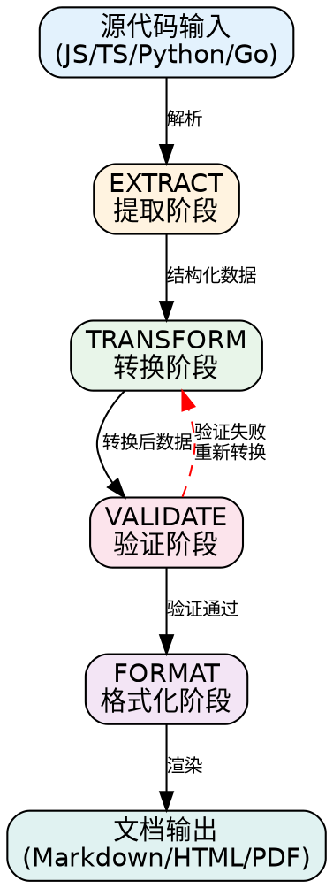

# Doc Generator Skill Example

> **类型**: Data Pipeline Skill  
> **用途**: 从代码和数据源自动生成文档  
> **认证**: SILVER 895/1000

---

## 功能特性

### 数据管道 (Data Pipeline)

Doc Generator 使用 ETVF（Extract-Transform-Validate-Format）流程处理文档生成：

```
[源代码]
    │
    ▼
[EXTRACT] 提取 → 解析注释、提取元数据
    │
    ▼
[TRANSFORM] 转换 → 标准化结构、丰富内容
    │
    ▼
[VALIDATE] 验证 → 模式检查、链接验证
    │
    ▼
[FORMAT] 格式化 → 渲染 Markdown、应用样式
    │
    ▼
[文档输出]
```

### 批处理 (Batch Processing)

支持整个目录的批量文档生成：

- **自动发现**: 递归扫描源代码目录
- **智能分块**: 大项目自动分块处理（每块100个文件）
- **并行处理**: 多文件并发处理
- **统一合并**: 生成一致的导航和搜索索引

### 多格式输出 (Multi-format Output)

| 输入格式 | 输出格式 | 状态 |
|---------|---------|------|
| JavaScript/TypeScript | Markdown | ✓ 支持 |
| Python | HTML | ✓ 支持 |
| Go | PDF | ✓ 支持 |
| OpenAPI/Swagger | Markdown | ✓ 支持 |
| Markdown | HTML/PDF | ✓ 支持 |

---

## 认证等级


**总分**: 895/1000

| 评估阶段 | 分数 | 满分 |
|---------|------|------|
| Phase 1 - Parse & Validate | 92 | 100 |
| Phase 2 - Text Quality | 268 | 300 |
| Phase 3 - Runtime Testing | 355 | 400 |
| Phase 4 - Certification | 180 | 200 |
| **总分** | **895** | **1000** |

---

## 数据管道流程图



---

## 使用示例

### 单文件文档生成

```bash
# 生成单个文件的API文档
skill invoke doc-generator --mode=generate --source=src/auth.js

# 指定输出路径
skill invoke doc-generator --mode=generate \
  --source=src/auth.js \
  --output=docs/api/auth.md
```

### 批量处理

```bash
# 批量生成整个项目的文档
skill invoke doc-generator --mode=batch \
  --source-dir=./src \
  --output-dir=./docs \
  --pattern="**/*.{js,ts}"

# 生成双语文档
skill invoke doc-generator --mode=batch \
  --source-dir=./src \
  --bilingual=true \
  --locales=en,zh
```

### 格式转换

```bash
# Markdown 转 HTML
skill invoke doc-generator --mode=convert \
  --input=README.md \
  --output=README.html \
  --to=html

# Markdown 转 PDF
skill invoke doc-generator --mode=convert \
  --input=README.md \
  --output=README.pdf \
  --to=pdf \
  --theme=github
```

---

## 输入/输出模式

### GENERATE Mode

为单个文件生成文档：

- 解析 JSDoc/Docstring 注释
- 提取函数签名和类型信息
- 生成代码示例
- 输出结构化 Markdown

### BATCH Mode

批量处理整个目录：

- 自动发现源文件
- 智能分块处理
- 生成统一导航
- 创建搜索索引

### CONVERT Mode

格式转换：

- Markdown ↔ HTML
- Markdown ↔ PDF
- OpenAPI → Markdown
- JSDoc → Markdown

---

## 质量门禁

| 指标 | 阈值 | 说明 |
|-----|------|------|
| 完整性 | ≥ 95% | 公共API必须有文档 |
| 准确性 | ≥ 90% | 代码示例必须可运行 |
| 一致性 | ≥ 95% | 风格和格式一致性 |
| 链接有效性 | 100% | 所有内部链接必须可解析 |
| 类型覆盖率 | ≥ 80% | 类型注解覆盖率 |
| 质量分数 | ≥ 85/100 | 综合文档质量 |

---

## 项目结构

```
examples/doc-generator/
├── skill.md           # 技能定义文件
├── README.md          # 本文件
└── eval-report.md     # 评估报告
```

---

## 相关链接

- [评估报告](./eval-report.md) - 详细评估结果
- [Skill Framework 规范](../../skill-writer.md) - 框架规范文档
- [Data Pipeline 模板](../../templates/data-pipeline.md) - 使用的模板

---

## 许可证

MIT License - 详见 skill.md
